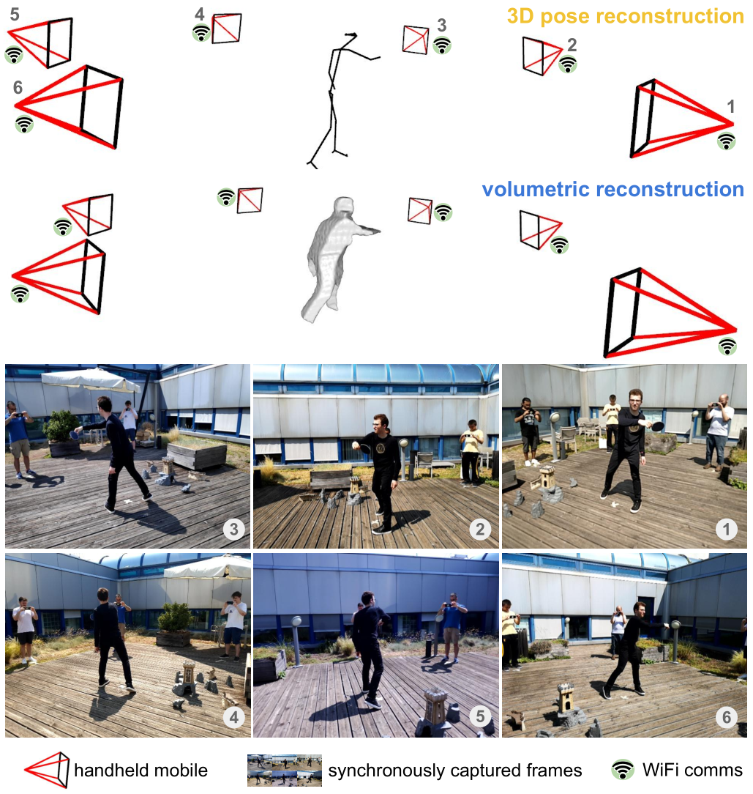

# Multi-view data capture for dynamic object reconstruction using handheld augmented reality mobiles

This repository contains a system to capture nearly-synchronous frame streams from multiple and moving handheld mobiles that is suitable for dynamic object 3D reconstruction. 
Each mobile executes Simultaneous Localisation and Mapping (SLAM) on-board to estimate its pose, and uses a wireless communication channel to send or receive synchronisation triggers.
We use the SLAM algorithm integrated in Android [ARCore](https://developers.google.com/ar).
Our system can harvest frames and mobile poses in real time using a decentralised triggering strategy and a data-relay architecture that can be deployed either at the Edge or in the Cloud.
We show the effectiveness of our system by employing it for 3D skeleton and volumetric reconstructions. 
Our triggering strategy achieves equal performance to that of an NTP-based synchronisation approach, but offers higher flexibility, as it can be adjusted online based on application needs.

[Paper (pdf)](https://arxiv.org/pdf/2103.07883.pdf)

<p align="center"></p>

## Modules

The 4DFY project can be divided into three main components:

- Android application: You can find the code and the instruction to compile it on the ```app``` folder
- Frame processing server: Code and installation instruction can be found in ```data-manager```
- MLAPI-server: Code and installation instruction can be found in ```mlapi-server```

- Preprocessing examples: You can find the code of the pre-processing used to evaluate the system

## Getting started

Please check the [documentation](doc/DOC.md)

## The 4DM dataset

<p align="center"></p>

[Download (zip)](https://drive.google.com/file/d/1AvkGph7TXxsxoqQXEVZErHHllutC4Ncc/view?usp=sharing)

This is the 4DM dataset that involves six people recording with their mobiles a person acting table tennis in an outdoor setting.
The 4DM dataset is characterised by cluttered backgrounds, cast shadows and people appearing in each other's view, thus becoming likely distractors for object detection and human pose estimation.

4DM is composed of three sequences: 
- 4DM-Easy: all mobiles are stably held by people during capture 
- 4DM-Medium: three out of six mobiles are stably held, the others undergo motion
- 4DM-Hard: all mobiles undergo motion

The host mobile generates triggers at 10Hz. Frames have a resolution of 640x480 and an average size of about 160KB. The latency between mobiles and the Relay Server was about 5ms.

## Citing our work

Please cite the following paper if you use our code or our dataset:

```latex
@article{Bortolon2021,
    title = {Multi-view data capture for dynamic object reconstruction using handheld augmented reality mobiles},
    author = {Bortolon, Matteo and Bazzanella, Luca and Poiesi, Fabio},
    journal = {Journal of Real-Time Image Processing},
    volume = {18},
    pages = {345–355},
    month = {Mar},
    year = {2021}
}
```

## Acknowledgements

This research has received funding from the Fondazione [CARITRO - Ricerca e Sviluppo](https://www.fondazionecaritro.it/) programme 2018-2020.
