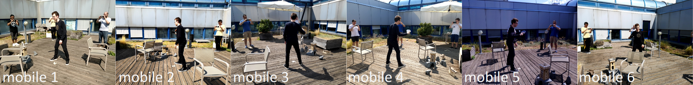

# Multi-view data capture for dynamic object reconstruction using handheld augmented reality mobiles
Coming soon ... (paper under review)

## The 4DM dataset

[Download (zip)](https://drive.google.com/file/d/1AvkGph7TXxsxoqQXEVZErHHllutC4Ncc/view?usp=sharing)

This is the 4DM dataset that involves six people recording with their mobiles a person acting table tennis in an outdoor setting.
The 4DM dataset includes cluttered backgrounds, cast shadows and people appearing in each other's view, thus becoming likely distractors for object detection and human pose estimation.

4DM is composed of three sequences: 
- 4DM-Easy: all mobiles are stably held by people during capture 
- 4DM-Medium: three out of six mobiles are stably held, the others undergo motion
- 4DM-Hard: all mobiles undergo motion

The host mobile generates triggers at 10Hz. Frames have a resolution of 640x480 and an average size of about 160KB. The latency between mobiles and the Relay Server was about 5ms.
